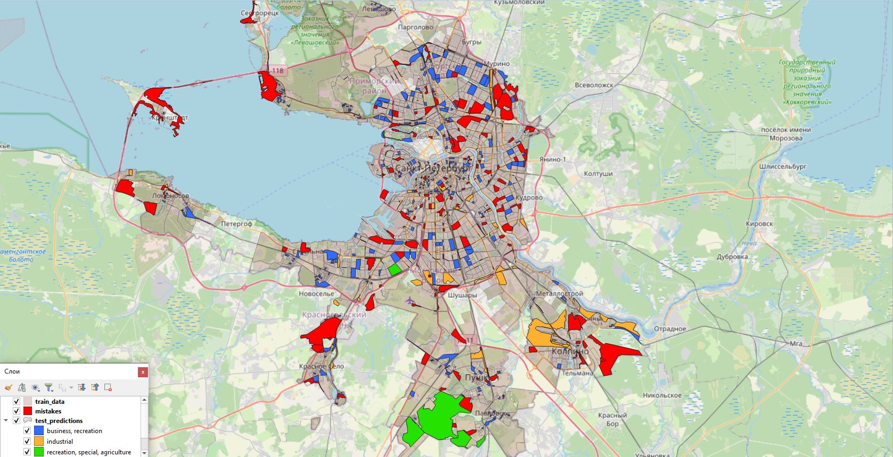

## Основная идея алгоритма

Пакет `landuse-rb` реализует пространственный классификатор типов землепользования:

1. **Входные данные** — `GeoDataFrame`, содержащий полигоны кварталов и метки `land_use_code`.
2. **Обучение** — модель обучается на пространственно-обогащённых признаках, включая:

   * агрегацию соседних объектов в буфере (по расстоянию),
   * признаки ближайших `k` соседей.
3. **Предсказание** — на тестовой выборке выполняется прогноз классов и вероятностей.
4. **Сохранение результатов**:

   * обучающая выборка (`train_data.geojson`),
   * тестовая выборка с предсказаниями (`test_predictions.geojson`),
   * ошибки классификации (`mistakes.geojson`).

Пример работы алгоритма — на изображении ниже:

